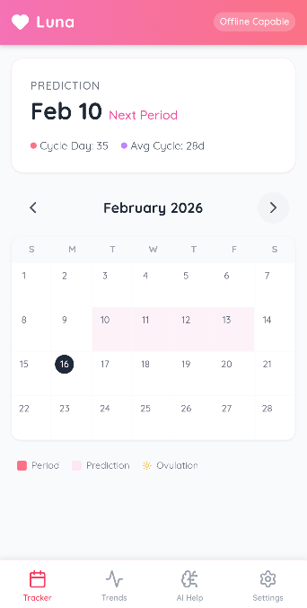
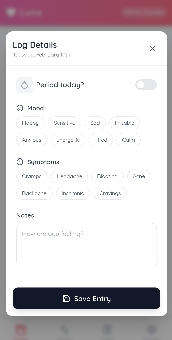

# Luna - Privacy-First Cycle Tracker

Luna is a privacy-focused menstrual cycle tracking application designed to run entirely offline on your device. It empowers users to track their cycles, symptoms, and moods without compromising their data privacy.

<div align="center">
<!-- Add a screenshot or banner here if available -->
</div>

<div align="center">
  
  
  <p><i>Left: Main Dashboard showing current cycle phase. Right: Detailed insights and cycle stats.</i></p>
</div>

## Features

*   **Privacy First**: All data is stored locally on your device. No data is sent to the cloud.
*   **Cycle Tracking**: Log your periods and predict future cycles.
*   **Symptom & Mood Logging**: Keep track of your daily symptoms and moods to understand your body better.
*   **Smart Cycle Predictions**: Local algorithms (TensorFlow.js) analyze your history to predict your next cycle.
*   **Pet Companion**: A fun, interactive pet companion that evolves with your usage.

### 🔬 Scientific Basis & Algorithms

Luna uses local, device-side processing to analyze your cycle. We believe in transparency about how your data is used to generate predictions:

1.  **Cycle Prediction (Linear Regression)**:
    *   We use **TensorFlow.js** to run a linear regression model directly on your phone.
    *   The model analyzes your last 6 cycles to identify trends and predict the length of your next cycle.
    *   *Fallback*: If you have fewer than 2 logged cycles, we use a standard 28-day model until enough data is collected.

2.  **Ovulation Estimation**:
    *   Currently, we estimate ovulation by calculating **14 days before your predicted next period start date**.
    *   This is based on the standard biological assumption of a 14-day Luteal phase.
    *   *Note*: This is an estimation and should not be used for contraception.

3.  **Phase-Based Insights**:
    Luna breaks your cycle down into the four hormonal phases to give you tailored advice:
    *   **Menstrual (Days 1-5)**: Focus on rest and iron-rich foods.
    *   **Follicular (Days 6-11)**: High energy! Great for HIIT and creative projects.
    *   **Ovulatory (Days 12-16)**: Peak social energy and confidence.
    *   **Luteal (Days 17-28+)**: Progesterone rises; focus on organizing and complex carbs to stabilize mood.

## Tech Stack

*   **Frontend**: [React](https://react.dev/) + [Vite](https://vitejs.dev/)
*   **Language**: [TypeScript](https://www.typescriptlang.org/)
*   **Mobile Framework**: [Capacitor](https://capacitorjs.com/) (Android)
*   **Local Intelligence**: Custom algorithms + [TensorFlow.js](https://www.tensorflow.org/js)
*   **Storage**: LocalStorage / Capacitor Preferences
*   **Styling**: CSS / Tailwind (if applicable)

## Getting Started

### Prerequisites

*   Node.js (v18 or higher recommended)
*   npm or yarn
*   Android Studio (for building the Android app)

### Installation

1.  Clone the repository:
    ```bash
    git clone https://github.com/rogerjs93/periodtracker.git
    cd periodtracker
    ```

2.  Install dependencies:
    ```bash
    npm install
    ```

3.  Run the web app locally:
    ```bash
    npm run dev
    ```

4.  Build and sync for Android:
    ```bash
    npm run build
    npx cap sync android
    npx cap open android
    ```

## Download

You can download the latest APK from the [releases directory](releases/Luna-Cycle-Tracker.apk) in this repository.

## Privacy Policy

**Luna is designed with privacy as its core principle.**

*   **Local Storage**: All your personal data, including cycle logs, symptoms, and notes, are stored locally on your device using Android's secure storage mechanisms.
*   **No Tracking**: We do not track your usage, location, or any personal information.
*   **Offline Intelligence**: All predictions and insights are generated directly on your device using local algorithms. No data is ever sent to external servers for processing.

## License

[MIT License](LICENSE)

## ⚠️ Medical Disclaimer

**Luna is NOT a medical device.**

The content, predictions, and insights provided by this application are for informational and educational purposes only. They are not intended to be a substitute for professional medical advice, diagnosis, or treatment.

*   **Accuracy**: While we strive for accuracy, cycle predictions and health insights are based on algorithms and general data, which may not apply to every individual's unique physiology.
*   **Consult a Professional**: Always seek the advice of your physician or other qualified health provider with any questions you may have regarding a medical condition.
*   **Emergencies**: If you think you may have a medical emergency, call your doctor or emergency services immediately.

**The developers of Luna assume no responsibility for any errors or omissions, or for the results obtained from the use of this information.**
